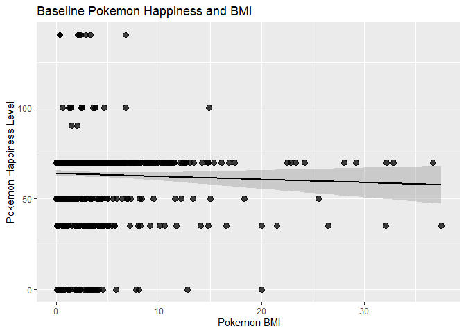
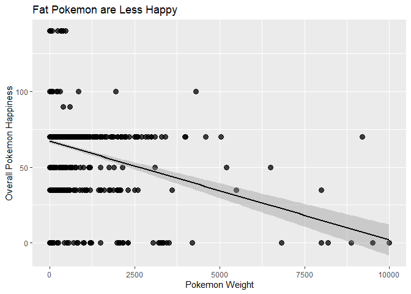

The Upcoming Pokemon Crisis Vignette
================
Mandy Liesch

-   [Required Packages](#required-packages)
-   [Function Creation](#function-creation)
    -   [Type Fuctions](#type-fuctions)
        -   [allPoke(): Returns ALL
            Pokemon](#allpoke-returns-all-pokemon)
        -   [types(): User Defined Type](#types-user-defined-type)
        -   [typeFrame(): Returning Several
            Columns](#typeframe-returning-several-columns)
        -   [listPrep(): Creating the Complete
            Dataframe](#listprep-creating-the-complete-dataframe)
        -   [cleanFrame(): Processing the Type Data into
            Columns](#cleanframe-processing-the-type-data-into-columns)
    -   [Generation Functions](#generation-functions)
        -   [allGen(): Returns All Generations of
            Pokemon](#allgen-returns-all-generations-of-pokemon)
        -   [genOut() Function](#genout-function)
        -   [genFrame(): Returning a Single Row of Generations
            Column](#genframe-returning-a-single-row-of-generations-column)
        -   [genListPrep(): Repeat the Generation
            Function](#genlistprep-repeat-the-generation-function)
        -   [cleanGen(): Cleaning the Generation
            Dataframe](#cleangen-cleaning-the-generation-dataframe)
    -   [Merging Functions](#merging-functions)
        -   [mergedFinal(): Merge the type and generation
            datasets](#mergedfinal-merge-the-type-and-generation-datasets)
-   [Data Analysis](#data-analysis)
    -   [Run the Functions](#run-the-functions)
    -   [Popular Pokemon Types](#popular-pokemon-types)
    -   [Are Fat Pokemon Happy?](#are-fat-pokemon-happy)
    -   [A Pokemon Regression Tree
        Exploration](#a-pokemon-regression-tree-exploration)
    -   [Pokemon Weight and Happiness Over
        Time](#pokemon-weight-and-happiness-over-time)
    -   [Does Type Influence Happiness and
        Weight?](#does-type-influence-happiness-and-weight)
-   [Conclusions](#conclusions)

# Required Packages

R is a super versatile software, and we are allowed to write many
different functions using a suite of packages that make analysis and
data science much easier. The required packages are as followed.

\*[`httr`
Package](https://cran.r-project.org/web/packages/httr/vignettes/quickstart.html):
is a package that provides a wrapper for the curl package, allowing
pulling of data from API web pages.

\*[`jsonlinte`
Package](https://cran.r-project.org/web/packages/jsonlite/index.html):
is a package that interprets and parses the json data output of the
APIs.

\*[`tidyverse` Package](https://www.tidyverse.org/): is a comprehensive
data management package, it includes functions to clean, manipulate, and
process data, and is one of the flagships of data science in R.

\*[`RCurl`
Package](https://cran.r-project.org/web/packages/RCurl/index.html): Like
httr, RCurl provides functions to allow one to compose general HTTP
requests and work with APIs.

\*[`ggplot` Package](https://ggplot2.tidyverse.org/): a comprehensive
graphing package from the tidyverse.

\*[`knitr` Package](https://www.r-project.org/nosvn/pandoc/knitr.html):
A package that manipulates data to control visual output.

\*[`tree`
Package](https://cran.r-project.org/web/packages/tree/tree.pdf): A
package that runs regression and classification trees.

# Function Creation

## Type Fuctions

### allPoke(): Returns ALL Pokemon

There are 18 different types of Pokemon. These 18 types apply to both
Pokémon and their moves. It is possible for Pokemon to have two
different types, but they usually have a primary type. This initial
function was created to help the user figure out which type they would
like to specify. There are several functions necessary to create the
output by type.

``` r
#Return all the pokemon names and their informative urls into a dataframe. 
allPoke<-function(){
  ### This function Connects to the Pokemon endpoint, using a limit 
  #to make sure all are returned.
  allPokeURL<-"https://pokeapi.co/api/v2/pokemon?limit=1500"
  #Utilize the RCurl to get all of the json data from the endpoint
  pokeData <- RCurl::getURL(allPokeURL)
  #Parse the JSon data into a list with the content variables
  pokeDataDF<-jsonlite::fromJSON(pokeData)
  #pull all of the important results into the dataframe 
  #(the pokemon name and URL)
  output <- pokeDataDF$results
  #Use the purr package to pull all of the JSON Data for each pokemon
  #URL into a list.
  pokeData1<-purrr::map(output$url, jsonlite::fromJSON)
  #Return this list when the function is called. 
  return(pokeData1)
}
```

### types(): User Defined Type

This function utilizes the Type endpoint to return the information of a
type that the user specifies. It has many different layers, and allows
the user to input a number from 1-20, that corresponds to a pokemon
type, OR a type character string, like ‘fire’. If ‘all’ is specified, a
list is returned with all pokemon, from the allPoke() function, listed
previously. If an incorrect string or number is put in, a list is
returned of appropriate options in Pokemon type.

``` r
types <- function(type){
  ###
  # This functions returns a data.frame with the numeric key and the name
  # of the types associated with pokemon. It can also return the data for 
  # a single type if a type ID number or name is passed.
  ###
  
  # Get the overall type from the type endpoint, allowing a user specified
  #type.
  baseURL<-"https://pokeapi.co/api/v2/type/"
  # pull the information for all types from the endpoint
  typeData <- RCurl::getURL(baseURL)
  # convert this into a dataframe
  typeDataDF<-jsonlite::fromJSON(typeData)
  # Select and create the type data.frame from the results.
  output <-  typeDataDF$results
  #Create a table to return the type and number in case bad input is
  #specified.
  outputType <- data.frame(type=1:20, output)
  
  #First If Function
  # If type does not equal "all", check if it is a valid pokemon type
  #or numeric value.
  if (type != "all"){
    
    # If type is in the numeric type column, subset output for just that row.
    if (type %in% outputType$type){
      #set the function to query
      pokeType <- type
      #Create the new link to read the user specified API value
      pokeTypeSpec <-GET(paste0(baseURL,pokeType))
      #Run the API through the data, return the JSON
      pokeTypeparsed <- pokeTypeSpec$content %>% rawToChar() %>% fromJSON()
      #Pull the desired data from the pokemon subset of list.
      typeParseRes<-pokeTypeparsed$pokemon
      #Use the purr package to return the json data
      pokePrimary<-purrr::map(typeParseRes$pokemon$url, jsonlite::fromJSON)
      #Return the dataframe.
      return(pokePrimary)
    }
    # If type is in the name column, subset output for just that table, see
    #above for documentation.
    if (type %in% outputType$name){
      pokeType <- type
      pokeTypeSpec <-GET(paste0(baseURL,pokeType))
      pokeTypeparsed <- pokeTypeSpec$content %>% rawToChar() %>% fromJSON()
      typeParseRes<-pokeTypeparsed$pokemon
      pokePrimary<-purrr::map(typeParseRes$pokemon$url, jsonlite::fromJSON)
      return(pokePrimary)
    }
    # Otherwise, if type does not equal all, throw an informative error,
    #return the options table.
    else {
    message <- paste("ERROR: The numeric Index of Pokemon Type, or Pokemon
                     Type is not clear.",
                     "Select from the menu above, or type('all') to find 
                     information of all of the Pokemon Type you're looking
                     for.")
    print(outputType[1:2])
    stop(message)
    }
  }
  #If the user specified the all function, return the output of the allPoke() function.
  else {
  pokePrimary<-allPoke() 
  return(pokePrimary)
  }
}
```

### typeFrame(): Returning Several Columns

The list function dataset is very complex. This nested function turns
the user specified type list into the dataframe that we desire. The
index value is a numerical input that is used to return the function.
Due to speed concerns, I removed this nesting function capability, for
processing, requiring data frames to be run with the user specified
query. The top lines of code change to:

``` r
typeFrame<-function(type, index){
  frame<-types(type)  
```

However, for speed reason, this is the function used. The index is a
numerical pokemon value. It outputs a single row with 12 columns.

``` r
typeFrame<-function(frame, index){
  ###
  # This functions takes the specified type defined by a dataframe in the types function,   # and creates one row of a dataframe by pokemon index number. 
  ###
 
  #for simplification, the indexing process is changed to a shorter command
  agg<-frame[[index]]
  #Pull the data for the pokemon ID. 
  pokeid<-agg$id
  #Pull the data for the pokemon Name.
  pokeName<-agg$name
  #Pull Pokemon Height Data
  pokeHeight<-agg$height
  #Pull Pokemon Weight Data
  pokeWeight<-agg$weight
  #Pull data from Type 1. 
  pokeType1<-agg$types$type$name[1]
  #Pull data from Type 2.
  pokeType2<-agg$types$type$name[2]
  #The stats column for pokemon stats is vertical, and needs to be           #transposed
  #so it fits onto one line. It is the first column of the $stats data.
  stats<-t(agg[["stats"]][1])
  #Create a dataframe
  pokeFinal<-as.data.frame(cbind(pokeid, pokeName, pokeHeight, pokeWeight,
                                 pokeType1, pokeType2, stats))
  #return the dataframe.
  return(pokeFinal)
}
```

### listPrep(): Creating the Complete Dataframe

This function is a wrapper function, that takes the single row output of
the typeFrame() function, and repeats it for the entire length of the
data frame generated from the type function.

``` r
listPrep<-function(typePrep){
  ###
  # This list prep function is a wrapper function that takes in the frame
  #specified by the user specified type functions, and populates the single
  #row from the typeFrame and passes it through the lapply function to get
  #a data frame.
  ###
  
  #To determine the number of repititions, we need to determine the length
  #of the types frame. 
  listLen<-length(typePrep)
  #Create the index to wrap through the lapply function.
  numIndex<-1:listLen
  #Run the typeFrame function on the user specified pokemon type frame the
  #number of times specified in the index.
  finalTypeFrame<-lapply(X = numIndex, FUN = typeFrame, frame=typePrep)
  #Format the lists into a data frame, and return the output.
  finalFrame<-do.call(rbind.data.frame, finalTypeFrame)
  return(finalFrame)
}
```

### cleanFrame(): Processing the Type Data into Columns

The list prep function creates a data frame, but it is all character
data. To utilize this data frame, the column names need to be changed,
formatted, and the extras are to be deleted. This function is a wrapper
to the listPrep() wrapper function, and generates a fully clean data
frame of the user specified type.

``` r
cleanFrame<-function(typePrep){
  ### The purpose of this function is to take the list run through 
  #lapply,and clean and correct the column formatting so the data can be
  #manipulated with dplyr.
  ###
  lapplyFrame<-listPrep(typePrep)
  #rename the columns to their correct name
  lapplyFrame$hp<-lapplyFrame$`1`
  #change the column type to numeric
  lapplyFrame$hp<-as.numeric(lapplyFrame$hp)
  #remove the old column value.
  lapplyFrame$`1`<-NULL
  #repeat this for all columns that it needs to happen to. 
  lapplyFrame$attack<-lapplyFrame$`2`
  lapplyFrame$attack<-as.numeric(lapplyFrame$attack)
  lapplyFrame$`2`<-NULL
  lapplyFrame$defense<-lapplyFrame$`3`
  lapplyFrame$defense<-as.numeric(lapplyFrame$defense)
  lapplyFrame$`3`<-NULL
  lapplyFrame$specialattack<-lapplyFrame$`4`
  lapplyFrame$specialattack<-as.numeric(lapplyFrame$specialattack)
  lapplyFrame$`4`<-NULL
  lapplyFrame$specialdefense<-lapplyFrame$`5`
  lapplyFrame$specialdefense<-as.numeric(lapplyFrame$specialdefense)
  lapplyFrame$`5`<-NULL
  lapplyFrame$speed<-lapplyFrame$`6`
  lapplyFrame$speed<-as.numeric(lapplyFrame$speed)
  lapplyFrame$`6`<-NULL
  lapplyFrame$pokeHeight<-as.numeric(lapplyFrame$pokeHeight)
  lapplyFrame$pokeWeight<-as.numeric(lapplyFrame$pokeWeight)
  lapplyFrame$pokeid<-as.numeric(lapplyFrame$pokeid)
  return(lapplyFrame)
}  
```

## Generation Functions

### allGen(): Returns All Generations of Pokemon

Like the allPoke() function above, this generation function queries the
Pokemon Species Endpoint API to get all of the information available.
This is not a function that is user queryable, and is part of the
generation function.

``` r
allGen<-function(){
  #Connect to the Pokemon Species endpoint, using a limit to make sure all
  #are returned.
  allGenURL<-"https://pokeapi.co/api/v2/pokemon-species?limit=1000/"
  #Utilize the RCurl to get all of the json data from the endpoint
  genData <- RCurl::getURL(allGenURL)
  #Parse the JSon data into a list with the content variables
  genDataDF<-jsonlite::fromJSON(genData)
  #pull all of the important results into the dataframe (the pokemon name
  #and URL)
  output <- genDataDF$results
  #Use the purr package to pull all of the JSON Data for each pokemon URL
  #into a list.
  genData1<-purrr::map(output$url, jsonlite::fromJSON)
  #Return this list when the function is called.
  return(genData1)
}
```

### genOut() Function

This function returns the user specified generational frame, including
wrapping in the all functions. It outputs a dataframe of lists that will
be run through future functions. Any user specified variables other than
the ‘all’ generations query the Generation endpoint.

``` r
genOut <- function(generation){
  ###
  # This functions returns a data.frame with the numeric key and the name
  #of the generations associated with pokemon. It can also return the data
  #for a single generation if a numeric ID of generation is passed.
  ###
  
  # Get the overall generation from the type endpoint, allowing a user
  #specified generation.
  baseURL<-"https://pokeapi.co/api/v2/generation/"
  #pull all of the generation URLs, and put them into a json.
  genData <- RCurl::getURL(baseURL)
  genDataDF<-jsonlite::fromJSON(genData)
  
  # Select and create the generation data.frame from the results.
  output <-  genDataDF$results
  #create the data frame needed for specifying errors.
  outputGen <- data.frame(gen=1:8, output)
  
  # If generation does not equal "all", check if it is a valid pokemon
  #generation or numeric value.
  if (generation != "all"){
    
    # If generation is in the number column, subset output for just that
    #row.
    if (generation %in% outputGen$name){
      #use the user specified value to generate the new API section.
      pokeGen <- generation
      #put the url into the API
      pokeGenSpec <-GET(paste0(baseURL,pokeGen))
      #parse through the data to get the URLs from the API query.
      pokeGenparsed <- pokeGenSpec$content %>% rawToChar() %>% fromJSON()
      #Pull data from the pokemon species subset of the generations.
      genParseRes<-pokeGenparsed$pokemon_species
      #Get the individual pokemon URLs
      genPrimary<-purrr::map(genParseRes$url, jsonlite::fromJSON)
      #Return the list.
      return(genPrimary)
    }
    # If generation is in the generation list column, subset output for
    #just that row.Repeats from above
    if (generation %in% outputGen$gen){
      pokeGen <- generation
      pokeGenSpec <-GET(paste0(baseURL,pokeGen))
      pokeGenparsed <- pokeGenSpec$content %>% rawToChar() %>% fromJSON()
      genParseRes<-pokeGenparsed$pokemon_species
      genPrimary<-purrr::map(genParseRes$url, jsonlite::fromJSON)
      return(genPrimary)
    }
    # Otherwise, throw an informative error to get the appropriate values
    #that occur.
    else {
    message <- paste("ERROR: The number or index of generation chosen is
                     not a valid selection.",
                     "Select from the menu above, of try generation('all')
                     to find the Pokemon and Generation you're looking
                     for.")
    print(outputGen[1:2])
    stop(message)
    }
  }
  #If all is specified, then run the allGen() function that we defined
  #earlier.
  else {
  genPrimary<-allGen() 
  return(genPrimary)
 } 
}
```

### genFrame(): Returning a Single Row of Generations Column

Like the type API, because of the volume of the output potential, the
object specified as the genOut() passes through this function as the
‘frame’ argument, and any number put into the index function returns an
individual pokemon’s row. This returns a single row

``` r
genFrame<-function(frame, index){
  ### 
  # This function, like the pokemon type frame, takes the user defined
  # generation data and gets the necessary data from the generation
  # list specified above.
  ###
  
  #This is a function to simplify the process later down the list.
  gen<-frame[[index]]
  #Get the pokemon ID
  pokeid<-gen$id
  #Get the pokemon name.
  pokeName<-gen$name
  #Pull the pokemon generation data
  pokeGen<-gen$generation$name
  #Grab the categorical pokemon growth rate.
  pokeGrowth<-gen$growth_rate$name
  #Pull the pokemon baseline happiness levels. 
  pokeHappy<-gen$base_happiness
  #Get the ease of capture rate
  pokeCapture<-gen$capture_rate
  #Bind everything together into one dataframe.
  pokeGenFinal<-as.data.frame(cbind(pokeid, pokeName, pokeGen, pokeGrowth,
                                    pokeHappy, pokeCapture))
  #return the final row in the data frame.
  return(pokeGenFinal)
}
```

### genListPrep(): Repeat the Generation Function

This function takes the generation function we defined before, and runs
it through the lapply function for the entire data frame.

``` r
genListPrep<-function(genPrep){
  ###
  # This list prep function is a wrapper function that takes in the
  #generation frame specified by the user specified type functions, and
  #populates the single row from the genFrame and passes it through the
  #lapply function to get a data frame.
  ###
  
  #To determine the number of repetitions, we need to determine the length
  #of the generation frame. 
  listLen<-length(genPrep)
  #Create the index to wrap through the lapply function.
  numIndex<-1:listLen
  #Run the genFrame function on the user specified pokemon generation frame
  #the number of times specified in the index.
  finalGenFrame<-lapply(X = numIndex, FUN = genFrame, frame=genPrep)
  #Format the lists into a data frame, and return the output.
  finalGenFrame<-do.call(rbind.data.frame, finalGenFrame)
  return(finalGenFrame)
}
```

### cleanGen(): Cleaning the Generation Dataframe

Like the previous type functions, the generation cleaning frame takes
the dataframe that was generated by the user specified generation value,
and converts the data into the correct formats.

``` r
cleanGen<-function(genPrep){
  ### 
  # The purpose of this function is to take the list run through lapply,
  # and clean and correct the column formatting so the data can be
  # manipulated with dplyr.
  ###
  
  #get the dataframe defined in the genListPrep() function.
  lapplyGen<-genListPrep(genPrep)
  #Convert the character data into numeric data.
  lapplyGen$pokeid<-as.numeric(lapplyGen$pokeid)
  lapplyGen$pokeHappy<-as.numeric(lapplyGen$pokeHappy)
  lapplyGen$pokeCapture<-as.numeric(lapplyGen$pokeCapture)
  #Return the data frame.
  return(lapplyGen)
}
```

## Merging Functions

### mergedFinal(): Merge the type and generation datasets

We have looked at the two main functions that are put together. In order
to do final anlysis (in my case), we want to have the generations data
set merged together with the pokemon dataset to get our final output
creation.

``` r
mergedFinal<-function(typePrep, genPrep){
  ###
  # This function takes the user defined type output, and generation 
  # output frames and merges them together into one final dataset, that
  # was built from four different APIs.
  ###
  
  #Call the cleaning frame of both the type, and generation.
  typeMerge<-cleanFrame(typePrep)
  genMerge<-cleanGen(genPrep)
  #Merge the files together by both the pokemon ID and pokemon name.
  finalMerge<-merge(typeMerge, genMerge, by=c('pokeid', 'pokeName'),
                    all.y=TRUE)
  return(finalMerge)
}
```

# Data Analysis

## Run the Functions

``` r
#Running the types function for the user determined function (want 'all'). Specify any of the types that the user wishes is possible (there are 20, for reference).
typeAllFrame<-types('all')
#Run the genOut function to determine the user defined generation data. Specify any geneartion of Pokemon (there are 8, for reference.)
genAllFrame<-genOut('all')
#Run the mergedFinal function to putt together the pokemon id and name, and 14 other desired variables. 
mergedFF<-mergedFinal(typeAllFrame, genAllFrame)

#Remove the columns that don't have primary types from analysis.
mergedFF<-mergedFF[!is.na(mergedFF$pokeType1),]
```

## Popular Pokemon Types

There are several different types of pokemon, and each of them have
several different characteristics that makes them desirable.

``` r
#Create a table with the overall primary type
tableType<-table(mergedFF$pokeType1,  mergedFF$pokeGen)
knitr::kable(
  tableType,
  caption=paste("Pokemon Type by Generation"),
  col.names = c("Gen 1", "Gen 2", "Gen 3", "Gen 4", "Gen 5", "Gen 6", "Gen 7", 
                "Gen 8")
)
```

|          | Gen 1 | Gen 2 | Gen 3 | Gen 4 | Gen 5 | Gen 6 | Gen 7 | Gen 8 |
|:---------|------:|------:|------:|------:|------:|------:|------:|------:|
| bug      |    12 |    10 |    12 |     7 |    18 |     3 |     9 |     3 |
| dark     |     0 |     5 |     4 |     3 |    13 |     3 |     1 |     7 |
| dragon   |     3 |     0 |     7 |     3 |     7 |     4 |     3 |     4 |
| electric |     9 |     6 |     4 |     7 |     6 |     3 |     4 |     8 |
| fairy    |     2 |     5 |     0 |     1 |     0 |     9 |     1 |     2 |
| fighting |     7 |     2 |     4 |     2 |     7 |     3 |     4 |     5 |
| fire     |    12 |     8 |     6 |     5 |     7 |     8 |     5 |     5 |
| flying   |     0 |     0 |     0 |     0 |     0 |     2 |     0 |     4 |
| ghost    |     3 |     1 |     4 |     5 |     5 |     2 |     3 |     4 |
| grass    |    12 |     9 |    12 |    12 |    15 |     5 |    12 |     8 |
| ground   |     8 |     3 |     6 |     4 |     8 |     0 |     2 |     3 |
| ice      |     2 |     4 |     6 |     3 |     6 |     2 |     0 |     4 |
| normal   |    22 |    15 |    18 |    17 |    16 |     4 |    12 |     4 |
| poison   |    14 |     1 |     3 |     6 |     2 |     2 |     6 |     1 |
| psychic  |     8 |     7 |     7 |     7 |    14 |     2 |     6 |     4 |
| rock     |     9 |     4 |     8 |     6 |     6 |     8 |     3 |     4 |
| steel    |     0 |     2 |     9 |     3 |     4 |     3 |     4 |     4 |
| water    |    28 |    18 |    24 |    13 |    15 |     5 |     8 |     9 |

Pokemon Type by Generation

``` r
#Create a table with the overall secondary type.
tableType<-table(mergedFF$pokeType2,  mergedFF$pokeGen)
knitr::kable(
  tableType,
  caption=paste("Pokemon Secondary Type by Generation"),
  col.names = c("Gen 1", "Gen 2", "Gen 3", "Gen 4", "Gen 5", "Gen 6", "Gen 7", 
                "Gen 8")
)
```

|          | Gen 1 | Gen 2 | Gen 3 | Gen 4 | Gen 5 | Gen 6 | Gen 7 | Gen 8 |
|:---------|------:|------:|------:|------:|------:|------:|------:|------:|
| bug      |     0 |     0 |     2 |     1 |     0 |     0 |     2 |     4 |
| dark     |     0 |     1 |     6 |     4 |     3 |     2 |     1 |     1 |
| dragon   |     0 |     1 |     2 |     2 |     3 |     5 |     4 |     7 |
| electric |     0 |     2 |     0 |     0 |     4 |     0 |     2 |     0 |
| fairy    |     3 |     3 |     5 |     1 |     2 |     4 |    10 |     4 |
| fighting |     1 |     1 |     3 |     5 |     7 |     1 |     6 |     0 |
| fire     |     0 |     2 |     0 |     0 |     7 |     0 |     2 |     2 |
| flying   |    19 |    19 |    12 |    14 |    15 |     6 |     6 |     0 |
| ghost    |     0 |     0 |     2 |     2 |     4 |     3 |     4 |     4 |
| grass    |     2 |     1 |     5 |     0 |     5 |     2 |     1 |     2 |
| ground   |     6 |     7 |     7 |     6 |     2 |     2 |     2 |     0 |
| ice      |     3 |     1 |     0 |     3 |     1 |     2 |     1 |     2 |
| normal   |     0 |     0 |     0 |     0 |     0 |     4 |     0 |     1 |
| poison   |    19 |     3 |     2 |     2 |     5 |     0 |     1 |     1 |
| psychic  |     6 |     3 |    12 |     2 |     0 |     3 |     2 |     3 |
| rock     |     2 |     3 |     4 |     1 |     4 |     0 |     0 |     1 |
| steel    |     2 |     2 |     0 |     7 |     8 |     0 |     4 |     1 |
| water    |     4 |     0 |     4 |     1 |     0 |     4 |     4 |     1 |

Pokemon Secondary Type by Generation

These types are not found in equal frequency in the poke-world. The most
common type is water, with 120 pokemon with water as their primary type,
followed by normal type, then Grass and Bug type, which account for 44%
of pokemon. The least popular primary type (flying), is the most common
secondary type (3x more common than any other secondary type). This
means that a lot of bird-like pokemon have other types that take
precedence over their classifications.

## Are Fat Pokemon Happy?

The thousands of different pokemon have an ideal weight and type
associated with their species. Poke-scientists have also studied the
baseline level of happiness that come when a person first catches a
pokemon. Some species are much happier than others. Does this correspond
with the pokemons overall weight?

To calculate the pokemon BMI, we need to use the dataframe we returned,
and the mutate function to create a new variable called BMI. There is
one miserable pokemon (Happiness of 0, with a BMI of nearly 10,000), so
we filter out his data, as it is an outlier.

``` r
#Calculate the BMI of pokemon
mergedFF<- mergedFF %>%
  mutate(BMI = pokeWeight/(pokeHeight*pokeHeight))

#Filter out the pokemon with the crazy high BMI.
plotFF<- mergedFF %>%
  filter(BMI < 50)
```

Then, we can plot the overall happiness of the pokemon, vs their BMI in
ggplot2.

``` r
plot1 <- ggplot(plotFF, aes(BMI,
                               pokeHappy)) +
  # Add a scatter plot layer and adjust the size and opaqueness of points.
  geom_point(size=3, alpha=0.75) + 
  # Remove the legend.
  theme(legend.position="none") + 
  # Add a black regression line.
  geom_smooth(method=lm, formula=y~x, color="black") + 
  # Add labels to the axes.
  scale_x_continuous("Pokemon BMI") + 
  scale_y_continuous("Pokemon Happiness Level") + 
  # Add a title.
  ggtitle("Baseline Pokemon Happiness and BMI")

plot1
```

<!-- -->

It appears that there is a slight negative correlation to baseline
happiness to BMI, however, it appears most pokemon are pretty happy,
despite their BMI. However, as the following plot shows, even with the
super high numbers filtered out, heavier pokemon still have a higher
overall sadness level, despite their density. As a super dense, yet
heavy human, and not a poke-scientist, I can only speculate that they
have bodily wear and tear from using their body, repeatedly in fights,
combined with the higher wear and tear of moving and feeding heavy mass.

``` r
plot2 <- ggplot(plotFF, aes(pokeWeight,
                               pokeHappy)) +
  # Add a scatter plot layer and adjust the size and opaqueness of points.
  geom_point(size=3, alpha=0.75) + 
  # Remove the legend.
  theme(legend.position="none") + 
  # Add a black regression line.
  geom_smooth(method=lm, formula=y~x, color="black") + 
  # Add labels to the axes.
  scale_x_continuous("Pokemon Weight") + 
  scale_y_continuous("Overall Pokemon Happiness") + 
  # Add a title.
  ggtitle("Fat Pokemon are Less Happy")

plot2
```

<!-- -->

\#\#Are Heavy Pokemon Powerful?

Now, we need to look at the overall statistics a pokemon has. This is
done by summing all of the attack, defense, speed, and hitpoints

``` r
#Use dplyr to calculate the total sum of the power statistics
plotFF<- plotFF %>%
  #Add a new column summing six numerical columns together.
  mutate(SUM = rowSums(.[7:12]))

plotFF<- plotFF %>%
  #Calculate the total attack stats in Pokemon.
  mutate(SumAttack = attack + specialattack)
```

Now, in most societies, power tends to be a good thing. And in pokemon,
the overall total sum of all of the statistics shows how much power and
value a pokemon has. Even though fat pokemon tend to have more power,
overall, it appears this level of power really weighs on their mind. The
colored circles represent the attack power, and the heavier a pokemon
is, the more power it has.

``` r
plot3 <- ggplot(plotFF, aes(SUM, pokeWeight, color=SumAttack)) +
  # Add a scatter plot layer and adjust the size and opaqueness of points.
  geom_point(size=3, alpha=0.75) + 
  # Add a color gradient for winPercentage.
  scale_color_gradient(low="blue", high="red") +
  # Remove the legend.
  theme(legend.position="none") + 
  # Add a black regression line.
  geom_smooth(method=lm, formula=y~x^2, color="black") + 
  # Add labels to the axes.
  scale_x_continuous("Sum of All Power Stats") + 
  scale_y_continuous("Pokemon Weight") + 
  # Add a title.
  ggtitle("Heavy Pokemon are More Powerful, Especially in Attack Power (Redder)")

plot3
```

<!-- -->

Like in people, big people know they are being used to lift heavy stuff,
and pull tall objects off the shelf. These high attack power and higher
stat pokemon are likely used in Poke-national defense, and super hard,
manual labor jobs, so the fact that heavier pokemon tend to be less
happy makes sense. Power is a heavy responsibility and weight these
heavy pokemon disproportionately wear.

## A Pokemon Regression Tree Exploration

There are several different machine learning algorithms that can be used
to explore data. In this case, I want to change pokemon happiness into
categorical factor values of high, and low, with a value of 65 (near
mean happiness) as the cutoff.

``` r
#attach the cleaned plot dataframe for analysis
attach(plotFF)
#Create a factor variable for sad and happy pokemon, with pokemon with happiness less than 65 as sad. 
High=factor(ifelse(pokeHappy<=65,"Sad","Happy"))
#remove all variables from analysis.
plotFFOut<-plotFF[3:18]
#Add the new variable to the dataframe.
plotFFHigh=data.frame(plotFFOut,High)
#Return the initial number of categorization nodes
tree.pokemon=tree(High~.-pokeHappy,plotFFHigh)
#put out the summary variables of the initial tree function.
summary(tree.pokemon)
```

    ## 
    ## Classification tree:
    ## tree(formula = High ~ . - pokeHappy, data = plotFFHigh)
    ## Variables actually used in tree construction:
    ## [1] "SUM"            "specialattack"  "BMI"            "specialdefense" "pokeCapture"   
    ## [6] "attack"         "pokeWeight"     "speed"          "pokeHeight"    
    ## Number of terminal nodes:  20 
    ## Residual mean deviance:  0.567 = 230.8 / 407 
    ## Misclassification error rate: 0.1171 = 50 / 427

There appears to be 20 different terminal nodes, which is a very
complicated tree to get happy and sad values. So, to get a final
product, we need to trim the tree. Looking at the plots calculated with
cross validation, a trimmed tree with 5 nodes is best.

``` r
#run a cross validation of the pokemon data
cv.pokemon=cv.tree(tree.pokemon,FUN=prune.misclass)
#plot the number of trees with the cross validation error.
plot(cv.pokemon$size,cv.pokemon$dev,type="b")
```

<!-- -->

``` r
#Run the pruning model with the misclassifications
prune.pokemon=prune.misclass(tree.pokemon,best=5)

#plot the newly trimmed tree
plot(prune.pokemon)

#with the text values.
text(prune.pokemon,pretty=0)
```

<!-- -->

This simplified tree shows that the less powerful pokemon (with SUM of
all stats less than 568.9), tend to be happier. If pokemon have high sum
of stats, only those have a low weight (less than 463 units), tend to
have high happiness. So, overall, the regression tree supports the
graphs looking at weight and power as a negative indicator.

## Pokemon Weight and Happiness Over Time

So, we have data over multiple generations, showing the avereage weight
of pokemon over time. This data can be summerized into categories and
shown in a table.

``` r
#creating a function to summerize pokemon weight by generation
breakdown <- plotFF %>%
 group_by(pokeGen) %>%
 summarise(Weight = mean(pokeWeight))

#Summerise pokemon Happiness by generations.
breakdown1 <- plotFF %>%
  group_by(pokeGen) %>%
  summarise(Happiness = mean(pokeHappy))

#merge the two data frames together for a numerical table.
fullbreak<-merge(breakdown, breakdown1, by='pokeGen')
```

It appears that, like American Society, pokemon are getting heavier and
sadder over time as well, peaking in generation 7, with sadness
continuing to decline over time substatially. Generation 4 was both fat,
and happy, but the wear of Pokesociety is starting to get to the newer
pokemon.

``` r
#Create a new table with the pokemon weight and happiness over time.
knitr::kable(
  fullbreak,
  caption=paste("Pokemon Weight and Happiness over Generations"),
  col.names = c("Generation",
                           "Weight",
                           "Happiness"),
  digits=2
)
```

| Generation      |  Weight | Happiness |
|:----------------|--------:|----------:|
| generation-i    |  459.52 |     69.74 |
| generation-ii   |  491.05 |     66.10 |
| generation-iii  |  671.25 |     62.43 |
| generation-iv   |  718.09 |     68.37 |
| generation-v    |  524.62 |     65.03 |
| generation-vi   |  532.63 |     66.25 |
| generation-vii  | 1046.45 |     51.22 |
| generation-viii |  747.69 |     48.67 |

Pokemon Weight and Happiness over Generations

## Does Type Influence Happiness and Weight?

Looking at generational and weight trends, it is possible to look at
trends by primary pokemon type.

``` r
typeWeight<- plotFF %>%
  group_by(pokeType1) %>%
  summarise(Weight = mean(pokeWeight))

typeHappy<- plotFF %>%
  group_by(pokeType1) %>%
  summarise(Happiness = mean(pokeHappy))

typeMerged<-merge(typeWeight, typeHappy, by= 'pokeType1', all=TRUE)


knitr::kable(
  typeMerged,
  caption=paste("Pokemon Weight and Happiness over Different Types"),
  col.names = c("Primary Type",
                           "Weight",
                           "Happiness"),
  digits=2
)
```

| Primary Type |  Weight | Happiness |
|:-------------|--------:|----------:|
| bug          |  330.24 |     66.35 |
| dark         |  618.78 |     42.36 |
| dragon       | 1024.45 |     43.39 |
| electric     |  426.15 |     63.09 |
| fairy        |  212.40 |     75.00 |
| fighting     |  558.56 |     65.00 |
| fire         |  610.50 |     65.54 |
| flying       |  339.67 |     56.67 |
| ghost        |  414.52 |     57.41 |
| grass        |  330.21 |     65.65 |
| ground       | 1248.09 |     66.18 |
| ice          | 1214.44 |     62.59 |
| normal       |  441.78 |     68.56 |
| poison       |  621.91 |     64.86 |
| psychic      |  359.61 |     65.74 |
| rock         | 1236.73 |     61.77 |
| steel        | 2105.24 |     46.55 |
| water        |  530.09 |     66.46 |

Pokemon Weight and Happiness over Different Types

The biggest discrepancy between the correlation of weight and type lie
with the goth, emo teenagers of the pokemon world: the dark pokemon.
They tend to have very low levels of baseline happiness, even though
they have an average weight that is around the mean. Dragons and steel
type pokemon also tend to be very miserable. Now, if I was a dragon, I
would be very happy, what with the massive power, dens, and treasure.
However, hoarding generally

``` r
#Create a dataframe with generations, types, and weights with the average by type.
typeGenWeight<- plotFF %>%
  group_by(pokeGen, pokeType1) %>%
  summarise(Weight = mean(pokeWeight))

#Summerise pokemon Happiness by generations.
typeGenHap <- plotFF %>%
  group_by(pokeGen, pokeType1) %>%
  summarise(Happiness = mean(pokeHappy))

#Merge the two files together so we can graph
typeBreak<-merge(typeGenWeight, typeGenHap, by=c('pokeGen', 'pokeType1'), all=TRUE)
```

Since Dark, Dragon, and Steel types are the saddest pokemon, we are
going to look at the trends in weight and time for these three types,
looking at the number of each of these types in a generation, and how
this corresponds to sadness.

``` r
#select the happiest and saddest pokemon types to graph the change over generations.
graphBreak<- typeBreak %>%
  filter(pokeType1 == "dark" |pokeType1 == "dragon"| pokeType1=="steel"
         |pokeType1=='fairy'|pokeType1=='normal'|pokeType1=='water')

#Create a plot with the six types selected above.
plot4<-ggplot(data=graphBreak, aes(x=pokeGen, y=Happiness, group=pokeType1,
                                   colour=pokeType1)) +
  #customize the line length and point size
  geom_line(size=2)+
  geom_point(size=2)+
  #scale the generation
  scale_x_discrete("Pokemon Generation") + 
  # Add a title.
  ggtitle("Pokemon Happiness and Type over Time")+
  #rotate the legend
  theme(axis.text.x = element_text(angle = 90))+
  #add a new legend label.
  labs(color='Primary Type') 

plot4
```

<!-- -->

However, looking at the overall data of even the happiest type of
pokemon, it is clear that there is a strong decline in happiness, even
for the vibrant fairy type pokemon. This shows, that even the optimists
are struggling now, where they never had before.

# Conclusions

This Pokemon Vignette uses several built in functions and tidyverse
packages to expose the increasing amount of sadness and heavier weights
occurring in the Pokemon Universe over time with visuals, graphs, and
tables. This is cutting edge research into newly arising problems in
pokemon culture. Future research questions include: \* Is this increase
in sadness a response to colonial expansion to these new areas in new
generations? Or are we just discovering more diverse colony types in
harsher parts of the world? \* Are these pokemon who are heavy and less
happy found in more rural areas? \* Where are the best places to put
pokemon intervention centers.
